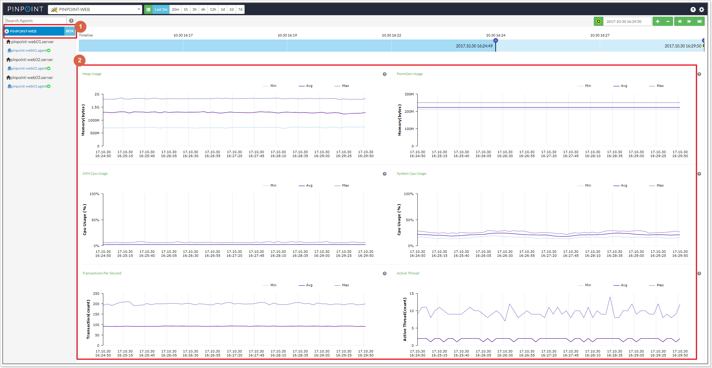

# application inspector 기능

## 1. 기능 설명

application inspector 기능은 agent들의 리소스 데이터(stat : cpu, memory, tps, datasource connection count)를 집계하여 데이터를 보여주는 기능이다. 참고로 application은 agent의 그룹으로 이뤄진다. 그리고 agent의 리소스 데이터는 agent inspector 화면에서 에서 볼 수 있다. application inspector 기능 또한 별도의 화면에서 확인할 수 있다.

inspector 화면 왼쪽 메뉴의 링크를 클릭하면 application inspector 버튼을 클릭하고 데이터를 볼 수 있다.

- 1  : application inspector menu, 2: application stat data


예를들면 A라는 application에 포함된 agent들의 heap 사용량을 모아서 heap 사용량 평균값 , heap 사용량의 평균값,  heap 사용량이 가장 높은 agentid와 사용량, heap 사용량이 가장 적은 agentid와 사용량을 보여준다. 이외에도 agent inspector 에서 제공하는 다른 데이터들도 집계하여 application inspector에서 제공한다.


application inspector 기능을 동작시키기 위해서는 [flink](https://flink.apache.org)와 [zookeeper](https://zookeeper.apache.org/)가 필요하고, 기능의 동작 구조와 구성 및 설정 방법을 아래 설명한다.

## 2. 동작 구조

application inspector 기능의 동작 및 구조를 그림과 함께 보자.


**A.** [flink](https://flink.apache.org)에 streaming job을 실행시킨다.
**B.** job이 실행되면 taskmanager 서버의 정보가 zookeeper의 데이터 노드로 등록이 된다.
**C.** collector는 zookeeper에서 flink 서버의 정보를 가져와서flin 서버와 tcp 연결을 맺고 agent stat 데이터를 전송한다.
**D.** flink 서버에서는 agent 데이터를 집계하여 통계 데이터를 hbase에 저장한다.

## 3. 기능 실행 방법

application inspector 기능을 실행하기 위해서 아래와 같이 설정을 변경하고 pinpoint를 실행해야 한다.

**A.** [테이블 생성 스크립트를 참조](https://github.com/naver/pinpoint/tree/master/hbase/scripts)하여 application 통계 데이터를 저장하는 'ApplicationStatAggre' 테이블을 생성한다.

**B.** flink 프로젝트 설정파일(pinpoint-flink.porperties)에 taskmanager 서버 정보를 저장하는 zookeeper 주소를 설정한다.
```properties
	flink.cluster.enable=true
	flink.cluster.zookeeper.address=YOUR_ZOOKEEPER_ADDRESS
	flink.cluster.zookeeper.sessiontimeout=3000
	flink.cluster.zookeeper.retry.interval=5000
	flink.cluster.tcp.port=19994
```

**C.** flink 프로젝트 설정파일(hbase.properties)에 집계 데이터를 저장하는 hbase 주소를 설정한다.
```properties
	hbase.client.host=YOUR_HBASE_ADDRESS
	hbase.client.port=2181
```

**D.** [flink 프로젝트](https://github.com/naver/pinpoint/tree/master/flink)를 빌드하여 target 폴더 하위에 생성된 streaming job 파일을 flink 서버에 job을 실행한다.
	- streaming job 파일 이름은 `pinpoint-flink-job.2.0.jar` 이다.
	- 실행방법은 [flink 사이트](https://flink.apache.org)를 참조한다.

**E.** collector에서 flink와 연결을 맺을 수 있도록 설정파일(pinpoint-collector.porperties)에 zookeeper 주소를 설정한다.
```properties
        flink.cluster.enable=true
	flink.cluster.zookeeper.address=YOUR_ZOOKEEPER_ADDRESS
	flink.cluster.zookeeper.sessiontimeout=3000
```

**F.** web에서 application inspector 버튼을 활성화 하기 위해서 설정파일(pinpoint-web.porperties)을 수정한다.
```properties
	config.show.applicationStat=true
```

## 4. streaming job 동작 확인 모니터링 batch

pinpoint streaming job이 실행되고 있는지 확인하는 batch job이 있다. 
batch job을 동작 시키고 싶다면 pinpoint web 프로젝트의 설정 파일을 수정하면 된다.

**`batch.properties`**
```properties
batch.flink.server=FLINK_MANGER_SERVER_IP_LIST
#`batch.flink.server` 속성 값에 flink job manager 서버 IP를 입력하면 된다. 서버 리스트의 구분자는 ','이다.
# ex) batch.flink.server=123.124.125.126,123.124.125.127
```
**`applicationContext-batch-schedule.xml`**
```xml
<task:scheduled-tasks scheduler="scheduler">
	...
	<task:scheduled ref="batchJobLauncher" method="flinkCheckJob" cron="0 0/10 * * * *" />
</task:scheduled-tasks>
```

batch job이 실패할 경우 알람이 전송되도록 기능을 추가 하고싶다면 `com.navercorp.pinpoint.web.batch.JobFailMessageSender class` 구현체를 만들고 bean으로 등록하면 된다.

## 5. 기타

자세한 flink 운영 설치에 대한 내용은 [flink 사이트](https://flink.apache.org)를 참고하자.
